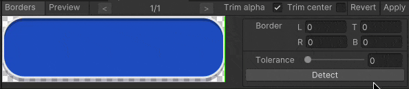
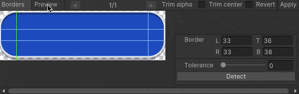
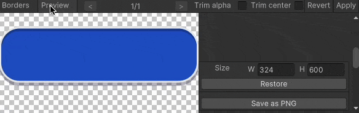
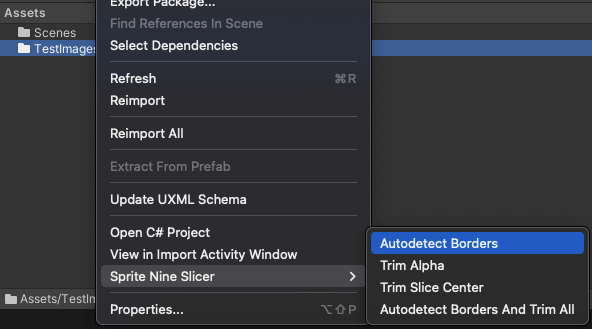
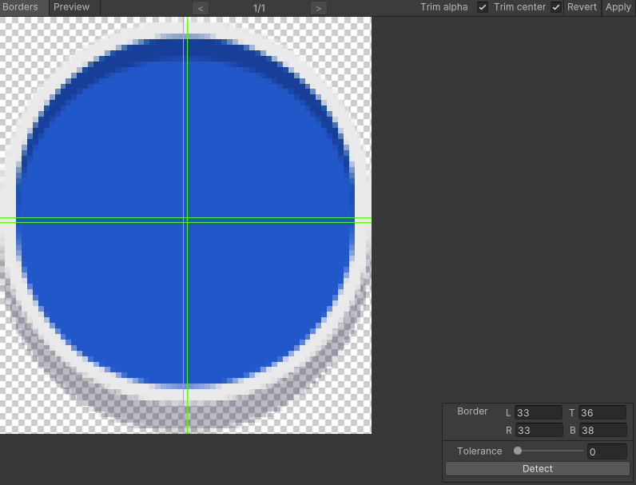
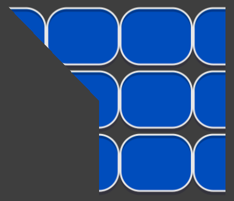
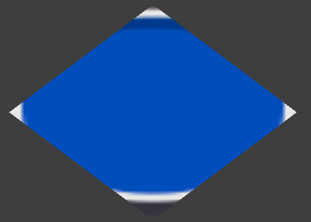

# Scale Nine Slicer

This package now consists of two parts:

1. An editor utility for automatic 9-slice sprite slicing.

2. A runtime component, an alternative to UI.Image, providing extended features for working with 9-slice sprites.

## Editor utility

A tool for automating work with 9 slice scaling in Unity.

### Automatic 9 slice borders detection.

### Trimming sliced sprite center to 1px.

### Trimming extra transparency.

### Usage:

#### Context menu in Project view

You can select textures and/or folders with sprites and perform an action on all contained sprites.

#### Editor window

If you want a more controlled result there is an editor window *(Window/2D/Sprite Nine Slicer)*.

Features:

- Works with multiple selection.
- Manual borders setting. You can zoom with ctrl/cmd key pressed and set borders via input fields or draggable lines on the image.
- You can enable or disable trimmings.
- You can preview the result, extend it to see how it works. Also you can export extended sprite to png.

#### API

Just create an instance of *SpriteInfo* and use it's public API. You can use it both in Unity Editor and at runtime.

## SlicedImage

A more flexible alternative to UI.Image that allows you to combine different sprite rendering modes:

### Sliced + filled

### Sliced + tiled + filled

### Custom filling

## Installation

There are 3 ways to install this plugin:
- clone/download this repository and move the Plugins folder to your Unity project's *Assets* folder
- *(via Package Manager)* add the following line to Packages/manifest.json:
  - "com.utkaka.scale-nine-slicer": "https://github.com/utkaka/ScaleNineSlicer.git",
- *(via OpenUPM)* after installing openupm-cli, run the following command:
  - openupm add com.utkaka.scale-nine-slicer
